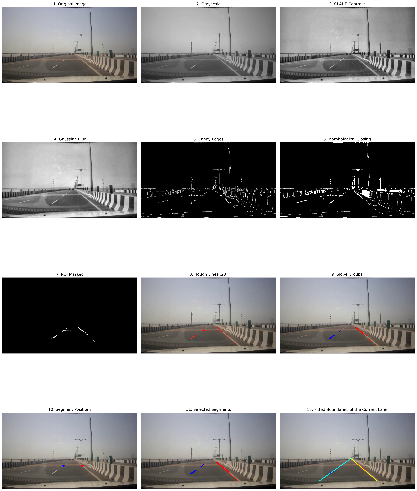

# Lane Departure Detection

A computer vision project for detecting lane boundaries and identifying lane departure from road videos using classical image processing techniques and OpenCV.

## Overview

This project implements a lane detection and lane departure detection pipeline for road videos.

The system processes each video frame through several stages, including image preprocessing, lane line detection, lane fitting, lane position estimation, and lane departure classification.

The goal is to determine whether the vehicle is staying within the current lane or departing toward the left or right side.

## Pipeline

The overall processing pipeline is:

Input Video
↓
Image Preprocessing
↓
Lane Line Detection
↓
Lane Segment Filtering
↓
Lane Line Fitting
↓
Lane Position Estimation
↓
Lane Departure Detection
↓
Visualization
↓
Output Video

## Features

- Grayscale conversion
- CLAHE-based contrast enhancement
- Gaussian blurring
- Canny edge detection
- Morphological closing
- Region of Interest (ROI)
- Probabilistic Hough Line Transform
- Lane segment filtering based on line slope
- Lane segment selection
- Lane line fitting
- Lane position estimation
- Lane offset calculation
- Left / Right lane departure detection
- Frame-based departure state management
- Lane detection visualization
- Departure warning visualization

## Project Structure

```text
lane-departure-detection-v1/
│
├── src/
│   ├── __init__.py
│   ├── preprocessing.py
│   ├── lane_detection.py
│   ├── lane_departure.py
│   ├── visualization.py
│   └── pipeline.py
│
├── app/
│   ├── __init__.py
│   ├── main.py
│   └── demo.py
│
├── notebooks/
│   └── one_frame.ipynb
│
├── data/
│   └── input/
│       ├── AS2.mp4
│       ├── AS3.mp4
│       ├── AS4.mp4
│       └── AS5.mp4
│
├── tests/
│
├── results/
│   └── demo.gif
│   └── result.mp4
│
├── README.md
├── requirements.txt
└── .gitignore
```

## Installation

Clone the repository:

```bash
git clone https://github.com/MJGholami96/lane-departure-detection-v1
cd lane-departure-detection-v1
```

Install the required dependencies:

```bash
pip install -r requirements.txt
```

## Usage

The input videos should be placed in:

```bash
data/input/
```

To run the lane departure detection pipeline:

```bash
python -m app.main
```

The processed video will be saved in:

```bash
results/result.mp4
```

To generate the demonstration GIF:

```bash
python -m app.demo
```

The generated demonstration will be saved in:

```bash
results/demo.gif
```

## Dataset

The input road videos used in this project are obtained from the **Indian Road Dataset** available on Kaggle.

Dataset source:

[Indian Road Dataset](https://www.kaggle.com/datasets/mansayy/indian-road-dataset)

The dataset is used as the source of the road videos for evaluating the lane detection and lane departure detection pipeline and is subject to its own terms and licensing conditions. Please refer to the original dataset source for details.

## Results

### Lane Detection Pipeline

The following figure shows the intermediate and final stages of the lane detection pipeline for a single video frame, including image preprocessing, edge detection, Hough line detection, lane segment filtering, and fitted lane boundaries.



### Lane Departure Detection Demo

The following GIF demonstrates the output of the lane detection and lane departure detection system:


## Limitations

This project is based on classical computer vision techniques and may be affected by:

- Poor lighting conditions
- Occluded or faded lane markings
- Complex road structures
- Sharp curves
- Shadows and reflections
- Camera movement
- Missing lane boundaries

## Future Improvements

Possible improvements include:

- More robust lane tracking
- Perspective transformation
- Temporal lane stabilization
- Improved handling of missing lane boundaries
- Better performance under challenging lighting conditions
- Further optimization of manually tuned parameters to improve the accuracy and robustness of lane detection under different road and lighting conditions.
- More comprehensive evaluation metrics

## Technologies

- Python
- OpenCV
- NumPy
- Matplotlib
- Pillow

## Acknowledgements

The road videos used for evaluation are obtained from the Indian Road Dataset on Kaggle.

Special thanks to the dataset authors for making the dataset available for research and development purposes

## License

This project is licensed under the MIT License. See the [LICENSE](LICENSE) file for details.

